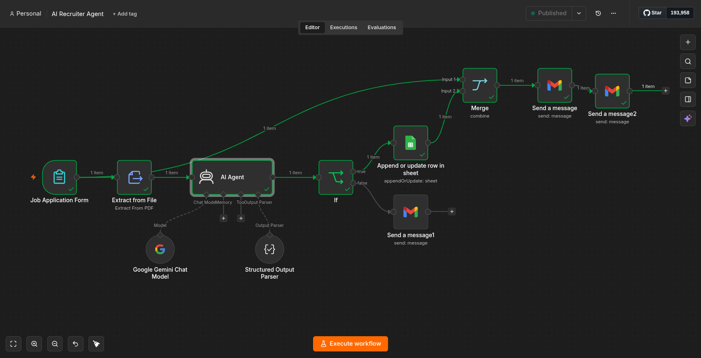
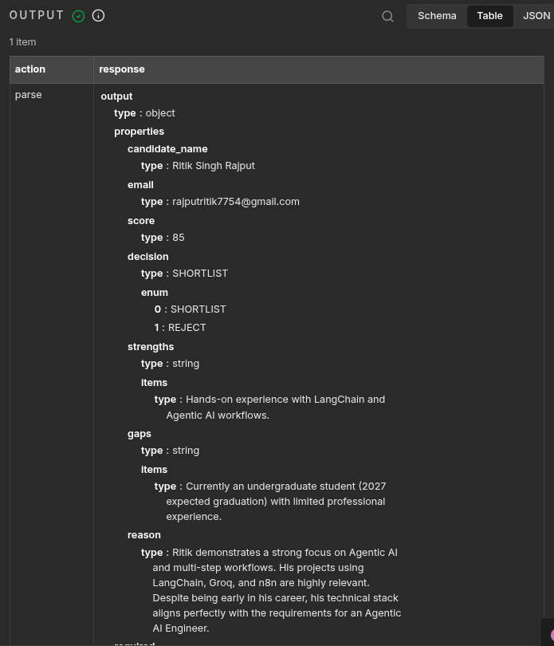
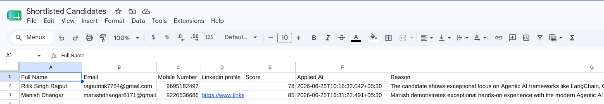
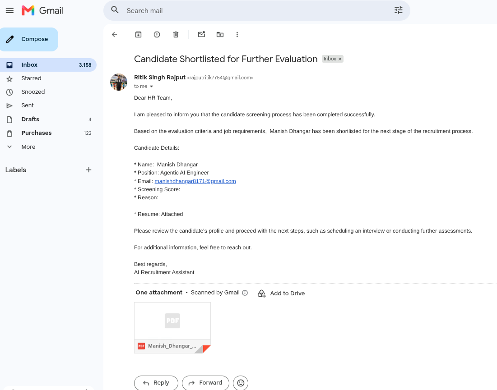
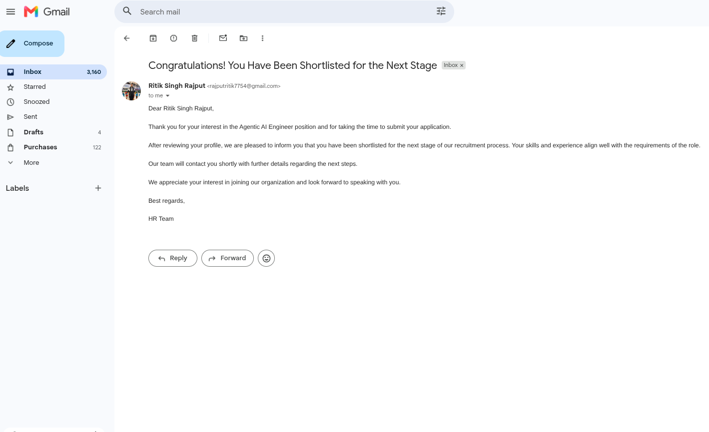
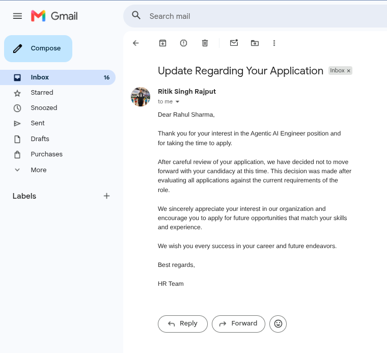

# AI Recruiter Agent

An AI-powered recruitment automation workflow built using **n8n** and **Google Gemini** that automatically screens resumes, evaluates candidates for Agentic AI Engineer roles, and streamlines the hiring process.

## Overview

The AI Recruiter Agent automates the initial recruitment workflow by:

* Extracting information from uploaded resumes.
* Evaluating candidates using Google Gemini.
* Generating candidate scores and hiring recommendations.
* Shortlisting qualified candidates automatically.
* Sending personalized emails to candidates.
* Notifying HR with candidate details and attached resumes.
* Storing recruitment data in Google Sheets.

## Features

✅ Resume PDF Parsing

✅ AI-Powered Candidate Evaluation

✅ Candidate Scoring (0–100)

✅ Strengths & Gap Analysis

✅ Automated Shortlisting

✅ Automated Rejection Emails

✅ HR Notification Emails

✅ Resume Attachment Handling

✅ Google Sheets Integration

✅ Structured Output Parsing

✅ Timestamp Logging

✅ Retry on Failure for Reliability

## Workflow Architecture

```text
Job Application Form
        ↓
Resume Extraction
        ↓
Google Gemini Evaluation
        ↓
Structured Output Parser
        ↓
Decision Engine
      ↙       ↘
Shortlist    Reject
    ↓           ↓
Google Sheet  Candidate Email
    ↓
HR Email + Resume Attachment
```

## Tech Stack

* n8n
* Google Gemini
* Gmail
* Google Sheets
* Structured Output Parser
* PDF Resume Extraction

## Candidate Evaluation Criteria

The AI evaluates candidates based on:

### Technical Skills

* Python
* APIs & Webhooks
* Git/GitHub
* Software Development Fundamentals

### Agentic AI Expertise

* AI Agents
* Multi-Agent Systems
* LLM Applications
* Prompt Engineering
* RAG Systems

### Frameworks & Tools

* LangChain
* LangGraph
* CrewAI
* AutoGen
* Vector Databases

### Automation & Deployment

* n8n
* REST APIs
* Workflow Automation
* Cloud Platforms

## Sample Output

```json
{
  "candidate_name": "John Doe",
  "email": "john@example.com",
  "score": 87,
  "decision": "SHORTLIST",
  "strengths": [
    "Python",
    "LangChain",
    "n8n Automation"
  ],
  "gaps": [
    "AWS Deployment"
  ],
  "reason": "Strong practical experience in Agentic AI and workflow automation."
}
```

## Screenshots

### Workflow


### AI Screening Results


### Google Sheets Output


### HR Notification Email


### Candidate Shortlisted Email


### Candidate Rejection Email


## Future Improvements

* Human approval step before final shortlisting
* ATS integration
* Candidate ranking dashboard
* Multi-role recruitment support
* Analytics and hiring reports

## Author

Ritik Singh Rajput

Passionate about Agentic AI, Workflow Automation, and AI-Powered Applications.

GitHub: https://github.com/Rajputritik9695
